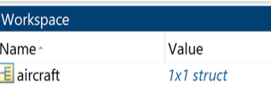
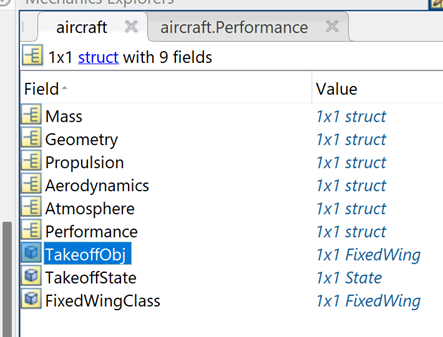
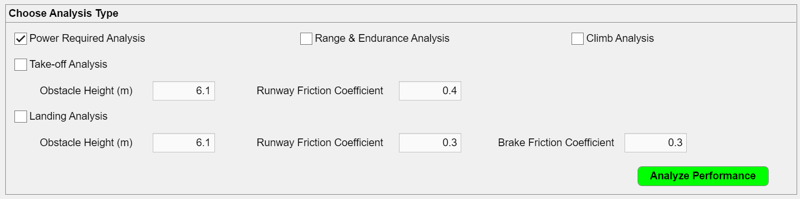
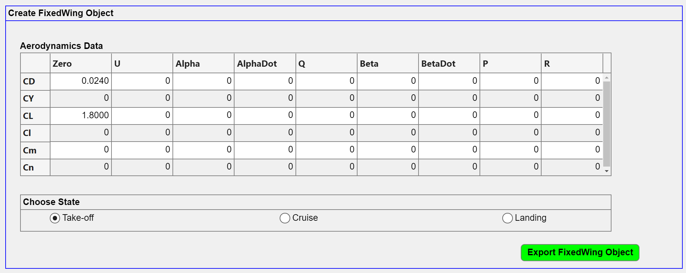
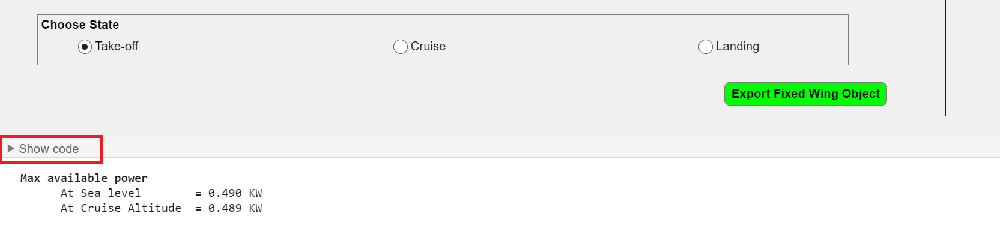
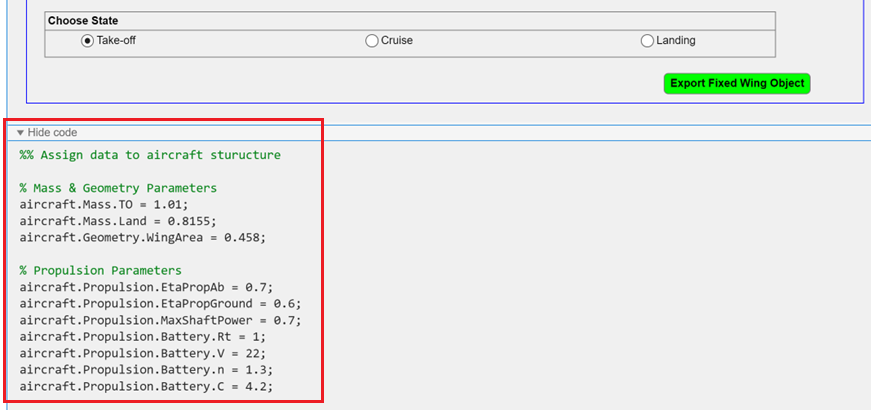
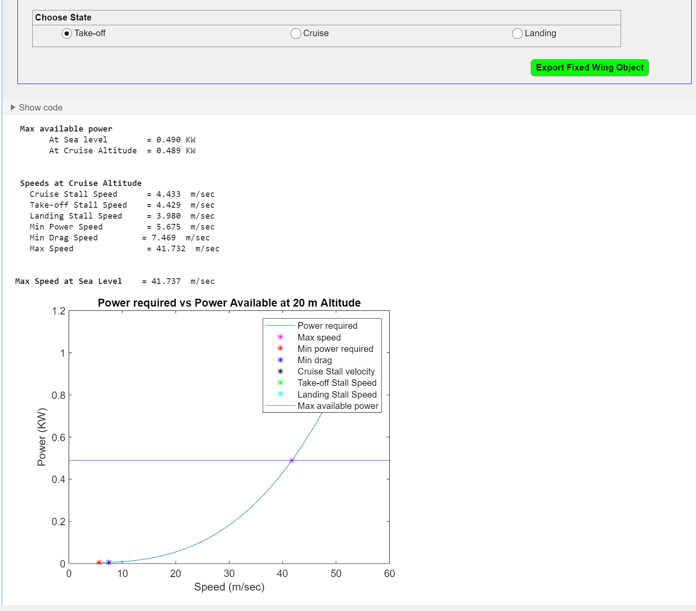

# Aircraft Performance Analyzer (APA) Live Task Documentation

## Inputs
-	**Mass & Geometry parameters:**
    *   Aircraft Take-off Mass (Kg): Gross weight of the aircraft during the take-off
    *   Aircraft Landing Mass (Kg): Gross weight of the aircraft during the landing
-	**Wing area (m2):** Wing planform area
-	**Propulsion parameters:**
    *   Propulsive Eff. (Airborne): Propulsive efficiency when aircraft is airborne
    *   Propulsive Eff. (Ground): Propulsive efficiency considering ground effect
    *   Battery Rating (Hours): The discharge time over which the capacity was determined (typically 1 h for small rechargeable battery packs)
    *   Battery Voltage (Volts)
    *   Battery Capacity (Ah)
-	**Aerodynamics parameters:**
    *   CD0: Profile drag coefficient.
    *   K: Lift-induced drag coefficient.
    *   CLMax: Maximum lift coefficient of the wing.
    *   CD0Flap (Take-off): Profile drag coefficient due to flap extension during the take-off.
    *   CD0Flap (Landing): Profile drag coefficient due to flap extension during the landing.
    *   CD0Flap (Landing Gear): Profile drag coefficient due to landing gear extension
    *   CLCruise: Lift coefficient during the cruise condition
    *   DelCLFlap (Take-off): Lift coefficient increment due to flap extension during take-off 
    *   DelCLFlap (Landing): Lift coefficient increment due to flap extension during landing
-	**Atmospheric parameters:**
    *   Altitude (m): Take-off, Cruise, Landing, and Climb
    *   Latitude and Longitude
-	**Take-off Analysis Inputs:**
    *   Obstacle Height (m): Obstacle height needs to be cleared
    *   Runway Friction Coefficient
-	**Landing Analysis Inputs:**
    *   Obstacle Height (m): Max height to start the landing phase
    *   Runway Friction Coefficient
-	**Aero Data Table:**
    |            | Zero | Alpha | AlphaDot | Q | Beta | BetaDot | P | R |
    |:-----------|:-----------|:-----------|:-----------|:-----------|:-----------|:-----------|:-----------|:-----------|
    | CD |Auto-calculated depending on the state (Take-off/ Cruise/ Landing)| | | | | | | |
    | CY | | | | | | | | |
    | CL |Auto-calculated depending on the state (Take-off/ Cruise/ Landing)| | | | | | | |
    | Cl | | | | | | | | |
    | CM | | | | | | | | |
    | CN | | | | | | | | |

    where
    *   CD: Drag coefficient
    *   CY: Side-force coefficient
    *   CL: Lift coefficient
    *   Cl: Rolling moment coefficient
    *   CM: Pitching moment coefficient
    *   CN: Yawing moment coefficient
    *   Alpha: Angle of attack
    *   AlphaDot: Rate of angle of attack
    *   Beta: Sideslip angle
    *   BetaDot: Rate of sideslip angle 
    *   P: Roll rate
    *   Q: Pitch rate
    *   R: Yaw rate

## Output
The live task generates an 'aircraft' structure and stores it in the workspace, comprising input data, performance results, and [Aero.FixedWing](https://in.mathworks.com/help/aerotbx/ug/aero.fixedwing-class.html) objects.
    <tr>
    <td>  </td>
    </tr>

The 'aircraft' structure contains the following data:
-   Inputs: Mass, geometry, propulsion, aerodynamics 
-   Atmospheric parameters: Various altitudes (input), latitude-longitude, and related gravitational acceleration and density
-   Performance: All the performance analysis results and related data
-   Aero.FixedWing class objects

    <tr>
    <td>  </td>
    </tr>

## How to use APA Live Task?
-  **Performance analysis:**
    *   First populate the input section with the appropriate data.
    *   From “Choose Analysis Type Section”, select the appropriate analysis type and press the “Analyze Performance” button.
    *   This will generate the ‘aircraft’ structure with all the input data and performance data.
    <tr> <td>  </td> </tr>

-	**Create FixedWing Object:**
    *   To create the FixedWing object, populate the aerodynamics data table with appropriate inputs.
    *   CD_Zero and CL_Zero, in the aerodynamics data table, are non-editable. They are calculated automatically by the performance analysis.
    *	Choose the appropriate state and click on the “Export FixedWing Object” Button.
    *   This will add [Aero.FixedWing](https://in.mathworks.com/help/aerotbx/ug/aero.fixedwing-class.html) object to the ‘aircraft’ structure.
    <tr>
    <td>  </td> </tr>

-   **Code Generation:** 
    *   On performing the analysis, the 'APA Live Task automatically generates the MATLAB® code which is accessed by clicking on the 'Show Code' drop-down button at the bottom of the live task.
    <tr>
    <td>  </td> </tr>

    *   This generated code can be modified if required.
    <tr> 
    <td>  </td></tr>

-   **Results**: The generated code is automatically executed and provides the results in the form of plots and numeric data.
    <tr> <td>  </td> </tr>

### 

<!--- Make sure you have a License.txt within your Repo --->
Copyright 2024 The MathWorks, Inc.

