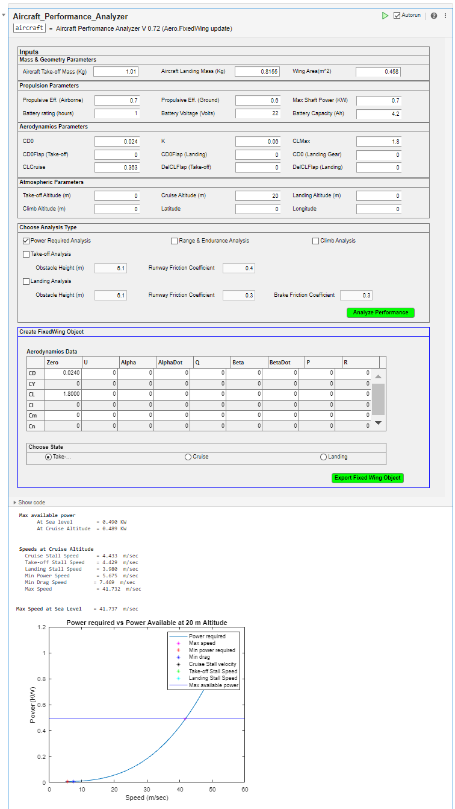
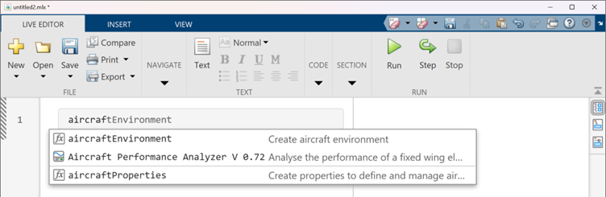

# Aircraft Performance Analyzer (APA) Live Task

<!--   --> 

 
<!-- Add this icon to the README if this repo also appears on File Exchange via the "Connect to GitHub" feature --> 

## Introduction

The APA Live Task lets you interactively analyze the performance of your electric fixed-wing aircraft design. These performance insights help you further optimize the design against the design requirements.
This live task offers multiple performance analysis capabilities:
1. Power requirements:  Required power, max. available power, drag vs. speed, max speed, min drag speed, stall speeds for various operations
2. Range and Endurance: Rangevs. speed, endurance vs. speed, and speeds for max range and max endurance
3. Take-off: Various take-off phases and total take-off distance
4. Landing: Various landing phases and total landing distance
   
Additionally,
-   you can export the [Aero.FixedWing](https://in.mathworks.com/help/aerotbx/ug/aero.fixedwing-class.html) object for further pursuing stability analysis.
-   you can edit the generated code and extend the performance analysis as per your requiremts. 

<tr>
<td>  </td> </tr>

## How to use it?
For detailed information on various inputs-outputs, and how to use the APA Live Task, please refer [Live Task Documentation](Live_Task_Documentation.md).  

## Setup
To run: 
1. Download the repository and open it in the MATLAB environment.
2. Install 'Aircraft Performance Analyzer (APA) Live Task.mltbx' by double clicking on it.
3. Open a new live script and start typing 'aircraft'. Select "Aircraft Performance Analyzer" from suggestions.
<td>  </td>

## MathWorks Products (https://www.mathworks.com)
<!--- Make sure you have a License.txt within your Repo --->
1. MATLAB release R2022a or higher
2. [Aerospace Toolbox](https://in.mathworks.com/help/aerotbx/)

## Additional resources
Learn MATLAB with following resources
1. [MATLAB Onramp](https://matlabacademy.mathworks.com/details/matlab-onramp/gettingstarted)
2. [Explore MATLAB  Examples and Documentation](https://in.mathworks.com/help/matlab/getting-started-with-matlab.html)
3. [Get Started with Introductory MATLAB Videos](https://in.mathworks.com/videos.html#matlabgetstarted)

## License
<!--- Make sure you have a License.txt within your Repo --->

The license for Sensitivity Analysis with MATLAB for Student Competition Scores is available in the License.txt file in this GitHub repository.

### 

For any queries, contact the authors at roboticsarena@mathworks.com
<!--- Make sure you have a License.txt within your Repo --->

<!--- Make sure you have a License.txt within your Repo --->
Copyright 2024 The MathWorks, Inc.

